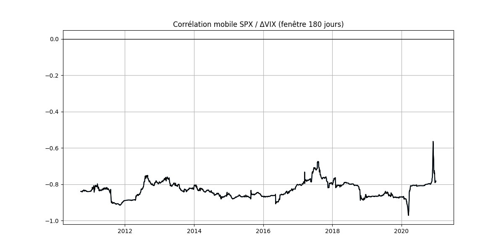

# SPX–VIX Correlation Analysis (2010–2020)

This project computes the empirical correlation between **S&P 500 log returns** and **changes in the VIX index** over the period **2010–2020**.  
It also plots the **180-day rolling correlation** to visualize how the relationship evolves over time.

The analysis is built using:
- `yfinance` for market data
- `pandas` and `numpy` for time series processing
- `matplotlib` for visualization

---

## Correlation Results

Using daily data from 2010 to 2020:

- **Correlation (SPX returns, ΔVIX)**: `-0.8249`  
- **Correlation (SPX returns, log VIX returns)**: `-0.7571`

These values confirm the well-known inverse relationship between equity returns and implied volatility increases.

---

## Rolling Correlation Plot

Below is the output image generated by the script (`corr-mob-spx-vix.png`):



The plot highlights periods of strong negative correlation, especially during major volatility events such as:
- 2011 U.S. debt ceiling crisis  
- 2015 China devaluation  
- Late 2018 market stress  
- March 2020 COVID crash  

---

## What the Script Does

The Python script:

1. **Downloads S&P 500 and VIX data (2010–2020)** using a robust retry method  
2. **Cleans and aligns the time series**  
3. Computes:
   - Log returns of the S&P 500  
   - Simple differences of the VIX  
   - Log returns of the VIX  
4. **Calculates correlations** between SPX returns and VIX variations  
5. **Plots a 180-day rolling correlation**  
6. **Saves the figure as `corr-mob-spx-vix.png`** (optional)

---

## How to Run

### 1. Install dependencies
```bash
pip install yfinance pandas numpy matplotlib
